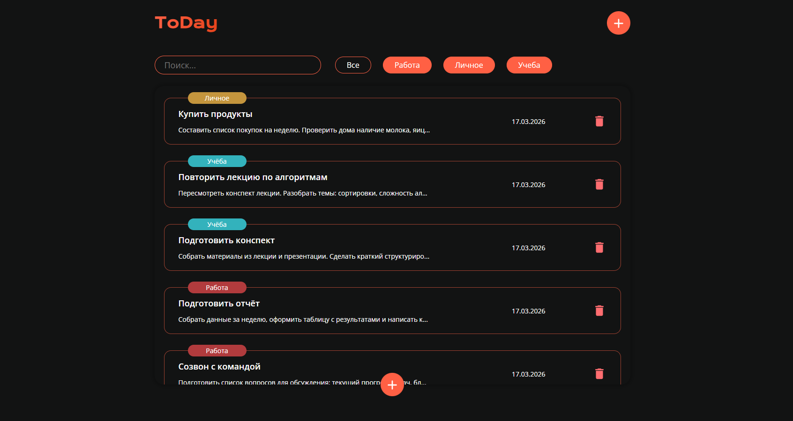

# ToDay — Приложение для управления заметками

Простое и функциональное приложение для создания заметок с фильтрацией по категориям и поиском. Проект создан в рамках глубокого изучения React Core и Hooks.

[Live demo](https://notes-app-opal-phi.vercel.app/)



## Основные возможности

- **CRUD операции**: Добавление и удаление заметок.
- **Персистентность**: Все данные сохраняются в `localStorage` через кастомный хук.
- **Умный поиск**: Живой поиск по заголовку и тексту с использованием **Debounce** (оптимизация ререндеров и производительности).
- **Фильтрация**: Сортировка заметок по категориям (Работа, Личное, Учеба).
- **Модальные окна**: Интуитивно понятный интерфейс добавления задач.

## Технологии

- **React 18** (Функциональные компоненты)
- **TypeScript** (Строгая типизация пропсов и данных)
- **Vite** (Быстрая сборка проекта)
- **SCSS** (Архитектура стилей)
- **Custom Hooks** (Логика работы с хранилищем)

## Как запустить проект

1. Склонируйте репозиторий:
    ```bash
    git clone https://github.com/twez0/NotesApp.git
    ```
2. Установите зависимости:
    ```bash
    npm install
    ```
3. Запустите проект в режиме разработки:
    ```bash
    npm run dev
    ```
